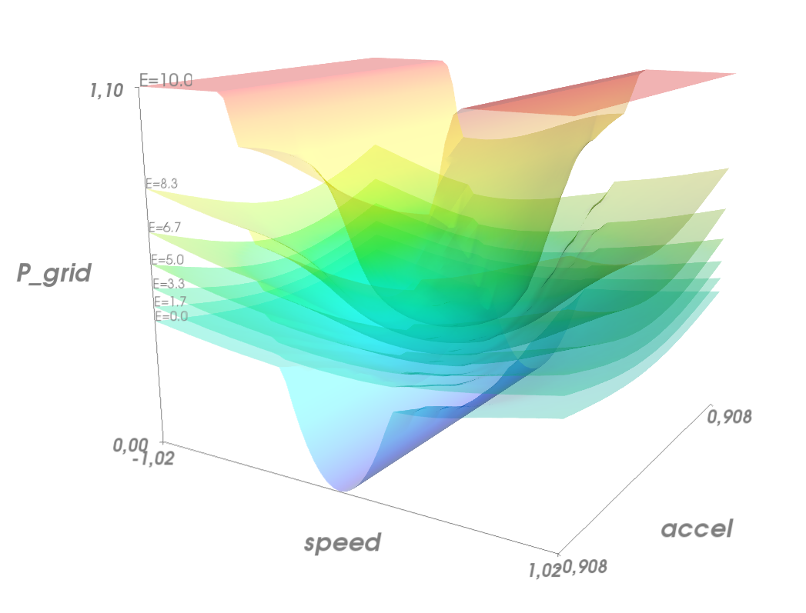

Searev Storage Control
======================

An example of *stochastic optimal control* for an Energy Storage System,
connected to a Ocean Wave Energy Converter (named "Searev").

The Wave Energy Converter generates a pulsating power, with some stochasticity
related to the randomness of ocean waves.
The Energy Storage is used to smooth out the power fluctuations of the Wave Energy Converter.

More explanations in this conference article:

P. Haessig, T. Kovaltchouk, B. Multon, H. Ben Ahmed, S. Lascaud,  
"Computing an Optimal Control Policy for an Energy Storage", EuroSciPy 2013  
http://arxiv.org/abs/1404.6389

Results
-------

Optimal control policy: P_grid = f(E_sto, speed, acceleration):

Simulated trajectories, comparing the optimal control (light blue) with a simple linear control (dark blue):

